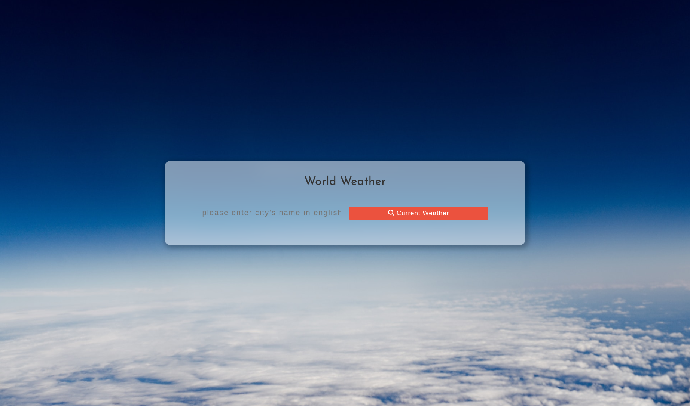

# Weather App

Live version: https://nao-nkgw-weather.netlify.app

# Description

Weather application built using React and CSS, Open Weather API.

# Installation Instructions

- clone repository
- npm install
- npm start

# Libraries and Technologies

- Open Weather API
- React JS
- JavaScript
- Font Awesome
- CSS
